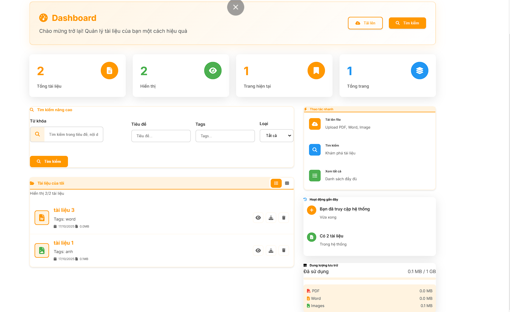
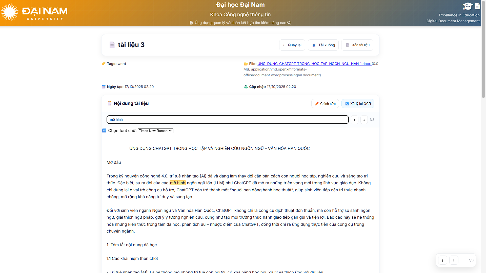

<h2 align="center">
    <a href="https://dainam.edu.vn/vi/khoa-cong-nghe-thong-tin">
    🎓 Faculty of Information Technology (DaiNam University)
    </a>
</h2>
<h2 align="center">
   Ứng dụng quản lý văn bản kết hợp tìm kiếm nâng cao
</h2>
<div align="center">
    <p align="center">
        
        
        
    </p>

[](https://www.facebook.com/DNUAIoTLab)
[](https://dainam.edu.vn/vi/khoa-cong-nghe-thong-tin)
[](https://dainam.edu.vn)
</div>

## 📖 1. Giới thiệu

Hệ thống quản lý tài liệu hỗ trợ tải lên PDF/Ảnh/Word, tự động OCR nội dung, lưu trữ metadata và cho phép tìm kiếm nâng cao tiếng Việt (không dấu, fuzzy, boolean/wildcard). Giao diện web dùng Jinja2, kèm các API trả JSON.

Các chức năng chính:
- 📤 Tải lên tài liệu (PDF/JPG/PNG/DOC/DOCX) và OCR tự động
- 🗂️ Quản lý metadata: tiêu đề, tags, dung lượng, loại file
- 🔎 Tìm kiếm nâng cao: không dấu, fuzzy (chịu lỗi), boolean, wildcard; sắp xếp theo mức liên quan
- 🧭 Phân trang thông minh, tự điều hướng khi vượt trang
- ⤵️ Tải xuống, 🗑️ xóa tài liệu, ♻️ xử lý lại OCR
- 🧾 Gợi ý từ khóa, thống kê số lượng và dung lượng lưu trữ

---

## 🛠️ 2. Công nghệ sử dụng

<p align="center">
  
  
  
  
  
  
</p>

Cấu trúc thư mục chính:
```
.
├── app/                    # Thư mục mã nguồn chính
│   ├── database.py         # Cấu hình và kết nối CSDL
│   ├── main.py             # Điểm khởi đầu của ứng dụng FastAPI
│   ├── models.py           # Các mô hình SQLAlchemy
│   ├── ocr.py              # Logic xử lý OCR
│   ├── schemas.py          # Các mô hình Pydantic (data validation)
│   └── routers/            # Các API endpoints
├── static/                 # Chứa các tệp tĩnh (CSS, JS, images)
├── templates/              # Chứa các template Jinja2
├── uploads/                # Thư mục lưu trữ các tệp được tải lên
├── requirements.txt        # Danh sách các thư viện Python
└── README.md               # Tệp này
```

---

## 🖼️ 3. Một số hình ảnh hệ thống

- Trang danh sách tài liệu, tìm kiếm nâng cao, phân trang (tối đa 5 mục/trang)

  
  
- Trang chi tiết với tìm kiếm trong nội dung, highlight không dấu và fuzzy, toast thông báo

  

---

## 🧭 4. Các bước cài đặt

### 4.1. Yêu cầu hệ thống
- Windows/Linux/macOS
- Python 3.10+
- MySQL 8.0+
- Tesseract OCR, Poppler (nếu xử lý PDF scan)

### 4.2. Cấu hình môi trường
Tạo và kích hoạt môi trường, cài thư viện:
```bash
python -m venv .venv
. .venv\Scripts\activate   # Windows
pip install -r requirements.txt
```

Tạo CSDL MySQL (ví dụ):
```sql
CREATE DATABASE docmgr CHARACTER SET utf8mb4 COLLATE utf8mb4_0900_ai_ci;
```

Tạo file `.env` và cấu hình (ví dụ):
```
# APP config
APP_HOST=0.0.0.0
APP_PORT=8000
APP_DEBUG=true
SECRET_KEY=${SECRET_KEY}

# MySQL config
MYSQL_HOST=127.0.0.1
MYSQL_PORT=3306
MYSQL_USER=${MYSQL_USER}
MYSQL_PASSWORD=${MYSQL_PASSWORD}
MYSQL_DB=${MYSQL_DB}

# File/Library paths
UPLOAD_DIR=uploads
TESSERACT_CMD=${TESSERACT_CMD}
POPPLER_BIN=${POPPLER_BIN}
EASYOCR_GPU=true
```

### 4.3. Chạy ứng dụng
```bash
uvicorn app.main:app --reload --host 0.0.0.0 --port 8000
```
Mở trình duyệt: `http://localhost:8000/documents`

---

## 📫 5. Liên hệ
- Họ và tên: Vũ Duy Thái
- Khoa: Công nghệ thông tin - Trường Đại học Đại Nam
- Liên hệ email: thaiitkk2004@gmail.com

<p align="center">© 2025 Faculty of Information Technology, DaiNam University.</p>

---
